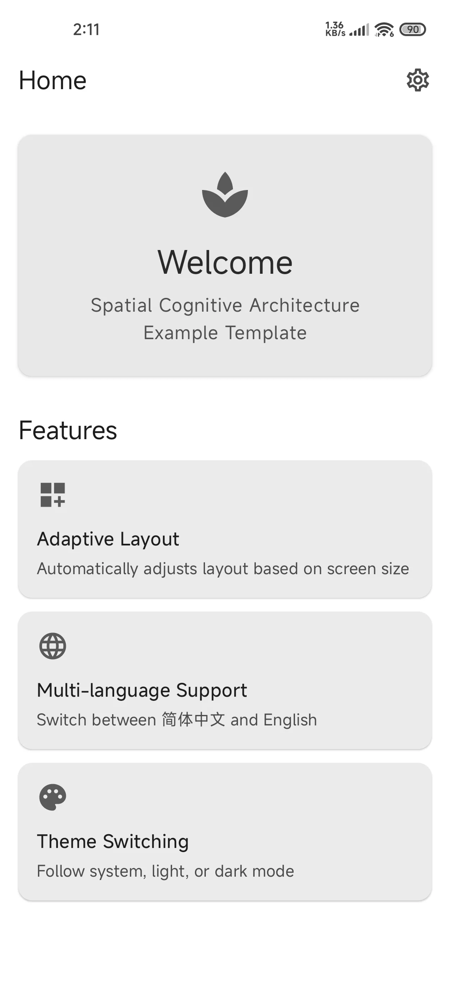
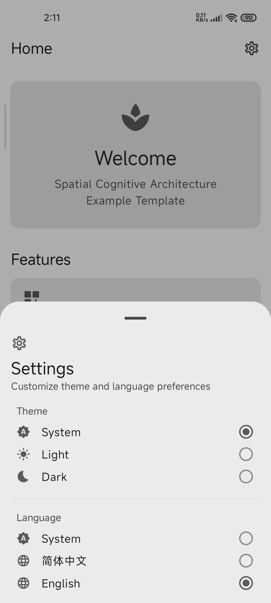
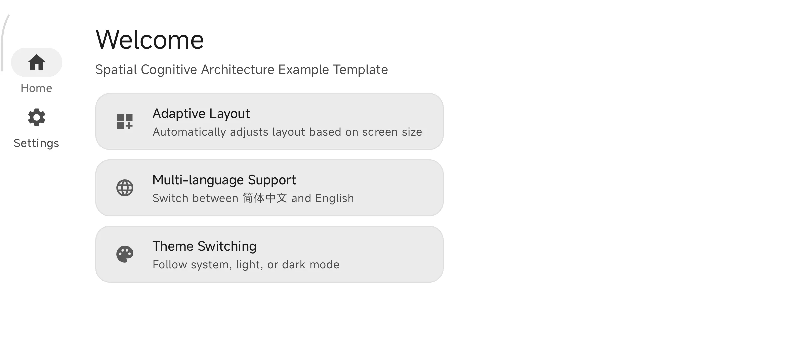
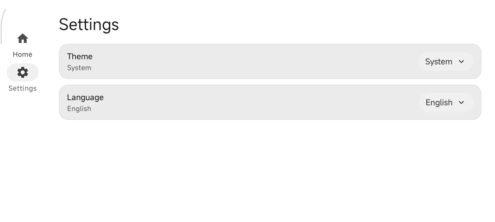

# App Template

一个基于 Jetpack Compose 的 Android 应用模板项目，采用 SOMA 架构（基于空间认知理念），开箱即用。

## 应用预览

<p align="center">
  
</p>

<p align="center">
  
</p>

<p align="center">
  
</p>

<p align="center">
  
</p>

## 功能特性

- **SOMA 架构** — 基于空间认知理念的目录组织，自顶向下映射 UI 物理空间
- **横竖屏物理隔离** — 竖屏 / 宽屏独立实现，禁止条件分支混用布局
- **两级组装** — 页面级 Assembly 决定空间分区排列，分区级 Panel 决定职责组件排列
- **多语言支持** — 支持简体中文、英文与跟随系统，应用内实时切换
- **主题切换** — 浅色 / 深色 / 跟随系统，运行时切换
- **边缘到边缘** — 支持 Edge-to-Edge 显示
- **依赖注入** — 基于 Koin 4.2，Application.onCreate() 手动启动，零模板代码
- **状态持久化** — Preference DataStore 存储主题、语言等用户偏好

## 技术栈

| 类别 | 技术 |
|------|------|
| 语言 | Kotlin 2.4 |
| UI | Jetpack Compose + Material 3（Compose BOM 2026.06.01） |
| 架构 | SOMA（Screen-Oriented Modular Architecture） |
| 依赖注入 | Koin 4.2（BOM 统管版本 + Application.onCreate 手动启动） |
| 导航 | Navigation3 1.1.4（NavKey + NavDisplay） |
| 状态管理 | Preference DataStore 1.2.1 + StateFlow（UDF 单向数据流） |
| 异步处理 | Kotlin Coroutines + Flow |
| 序列化 | Kotlin Serialization 1.11 |
| 自适应 | Material 3 Adaptive 1.2 |
| 版本管理 | refreshVersions 0.60.6（自动生成 libs.versions.toml） |
| 构建 | AGP 9.2.1 + Gradle 9.6.1 |

## 环境要求

- Android SDK：minSdk 32 / targetSdk 37 / compileSdk 37
- JDK 21
- Kotlin 2.4.0
- AGP 9.2.1
- Gradle 9.6.1

## 项目结构

```
app/src/main/kotlin/com/template/evilgodxu/
├── TemplateActivity.kt              # 单一 Activity，Edge-to-Edge、主题/语言初始化
├── TemplateApplication.kt            # 应用入口，startKoin 手动启动 Koin
├── TemplateViewModel.kt             # 全局根 ViewModel（预留）
├── data/
│   └── repository/
│       └── UserPreferencesRepository.kt # Preference DataStore 用户偏好仓库
├── di/
│   └── AppModule.kt                    # Koin 依赖注入模块
├── infrastructure/
│   └── adaptive/
│       └── WindowSizeClass.kt          # CompositionLocal 窗口尺寸三件套
├── navigation/
│   ├── AppNavHost.kt                   # Navigation3 导航宿主（NavDisplay）
│   └── Screen.kt                       # NavKey 路由定义（@Serializable）
├── screen/
│   └── home/                           # [第一层] 页面
│       ├── HomeScreen.kt               # 路由入口，按 WindowSizeClass 分发 Assembly
│       ├── HomeViewModel.kt            # 页面级 ViewModel
│       ├── HomeUiState.kt              # 页面级 UI 状态
│       ├── portrait/                   # [第二层] 竖屏
│       │   ├── PortraitAssembly.kt     # 竖屏页面级组装入口
│       │   ├── top_toolbar/            # [第三层] 空间分区：顶部工具栏
│       │   │   ├── TopToolbar.kt
│       │   │   ├── SettingsSheet.kt
│       │   │   └── OptionItem.kt
│       │   └── middle_panel/           # [第三层] 空间分区：中部内容
│       │       ├── MiddlePanel.kt
│       │       ├── welcome_card/       # [第四层] 职责组件
│       │       │   └── WelcomeCard.kt
│       │       └── features/
│       │           └── FeatureCard.kt
│       └── landscape/                  # [第二层] 宽屏
│           ├── LandscapeAssembly.kt    # 宽屏页面级组装入口
│           └── main_workspace/         # [第三层] 空间分区：主工作区
│               ├── MainWorkspace.kt
│               ├── sidebar/            # [第四层] 职责组件
│               │   ├── LeftPanel.kt
│               │   └── LandscapeTab.kt
│               ├── home_summary/
│               │   ├── HomeSummary.kt
│               │   └── FeatureCard.kt
│               └── settings/
│                   └── SettingsPanel.kt
└── theme/
    ├── Color.kt                        # 完整 Material 3 调色板
    ├── Theme.kt                        # 主题（浅色/深色/动态取色）
    └── Type.kt                         # 排版样式
```

## SOMA 架构说明

本项目采用 **SOMA（Screen-Oriented Modular Architecture）** 架构，基于"空间认知理念"制定：

### 四层空间目录结构

1. **第一层 - 屏幕/页面**：按业务页面划分（如 `home/`）
2. **第二层 - 屏幕方向**：严格区分竖屏 `portrait/` 与宽屏 `landscape/`
3. **第三层 - 空间分区**：按物理屏幕视觉区块语义命名（如 `top_toolbar/`、`sidebar/`）
4. **第四层 - 职责组件**：按组件职责拆分，自给自足的独立单元

### 核心规范

- **物理隔离原则**：竖屏与宽屏独立实现，禁止使用 `if`/`when` 混用布局
- **两级组装**：`HomeScreen` 路由入口按 `WindowSizeClass` 分发到 `PortraitAssembly` 或 `LandscapeAssembly`
- **WindowSizeClass 三件套**：`LocalWindowSizeClass` + `ProvideWindowSizeClass` + `rememberWindowSizeClass()`
- **UDF 单向数据流**：State 向下流动（ViewModel → UI），Event 向上流动（UI → ViewModel）
- **数据三级分层**：顶层 `data/`（跨页面）→ 页面级 `screen/{page}/data/` → 组件级
- **Navigation3 强制**：使用 `NavKey` + `NavDisplay`，禁止使用 Navigation2

## 发布版构建配置

项目配置了完整的发布版构建流程，包括签名和代码混淆：

### 签名配置

发布版使用 `local.properties` 管理密钥信息：

```properties
KEYSTORE_PASSWORD=your_keystore_password
KEY_ALIAS=your_key_alias
KEY_PASSWORD=your_key_password
```

签名文件 `jh.keystore` 需放置于项目根目录。

### 构建类型

| 类型 | 特性 |
|------|------|
| **Release** | 启用代码混淆、资源压缩、PNG 优化、签名打包 |
| **Debug** | 关闭调试标志，启用 ProGuard 规则 |

### 构建命令

```bash
# 构建发布版 APK
./gradlew assembleRelease

# 构建发布版 AAB
./gradlew bundleRelease
```

### 构建优化

- Gradle 并行构建 + 构建缓存 + 按需配置
- R8 全模式混淆优化
- Kotlin 增量编译
- 只打包 `arm64-v8a` 架构
- 腾讯云 Maven 镜像加速依赖下载
- refreshVersions 插件管理依赖版本

## 构建与运行

1. 克隆仓库

```bash
git clone https://github.com/Evilgodxu/kotlin-android-template.git
```

2. 使用 Android Studio 打开项目

3. 配置签名（可选，用于发布版构建）
   - 在项目根目录创建 `local.properties` 文件
   - 添加密钥配置信息

4. 同步 Gradle 后直接运行

## 许可证

[MIT License](LICENSE)
